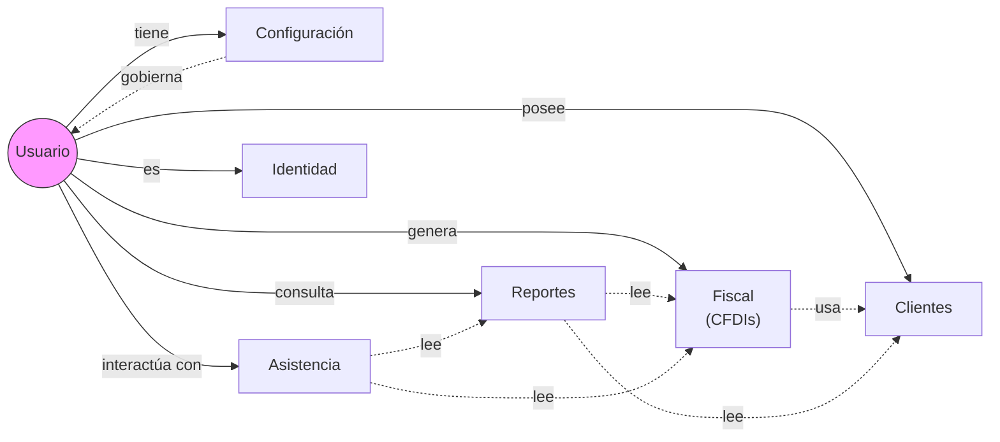
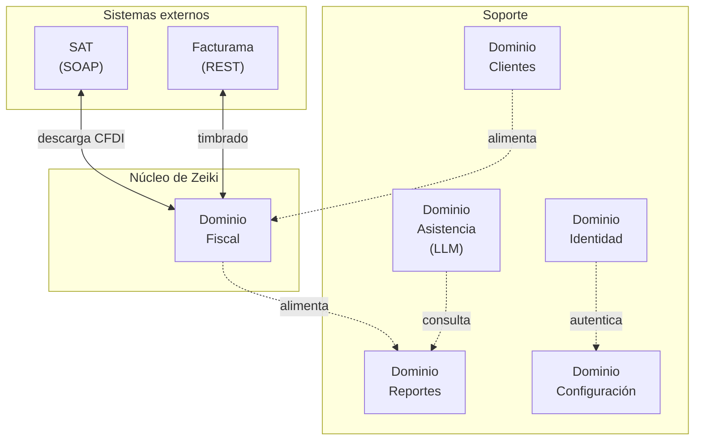
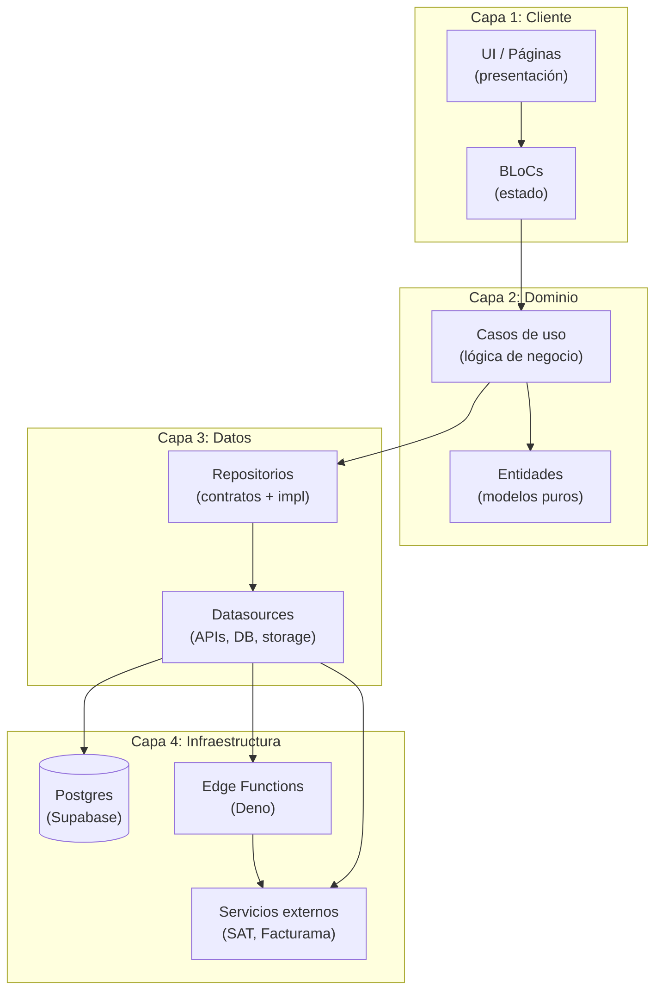

# Target Architecture — Zeiki

> **El plano maestro hacia donde va Zeiki.** Documento vivo, vigente para migraciones totales o parciales.
>
> **Última actualización:** 2026-07-29 (v2: feedback de Hugo, 5 nuevas secciones)
> **Estado del proyecto:** Fase 1 — MVP. Reescritura desde cero iniciada el 2026-07-29.

---

## Slogan

> **La arquitectura soporta las features, no las dicta.**

Este documento describe **cómo se construye cualquier feature** de Zeiki, no **qué features específicas** tendrá el producto. Si una sección dice "el feature X hace Y", está mal escrita.

---

## 📍 Dónde está Zeiki hoy

Zeiki se encuentra en la **Fase 1 (MVP)** del roadmap arquitectónico. La reescritura desde cero arrancó el 2026-07-29 con la aprobación de este documento. El código del proyecto anterior se conserva únicamente como **referencia para comprender reglas de negocio, algoritmos o integraciones** cuando resulte útil — no se arrastra su deuda técnica.

---

## 🧭 Mapa del negocio

Antes de hablar de capas o de features, hay que entender **qué es Zeiki en su esencia**. Esta sección es el "corazón" del producto. Todo lo demás del documento existe para soportar este flujo.

### Core del negocio

El corazón de Zeiki no es Flutter, ni Supabase, ni BLoC. Es este flujo:

```
Usuario
  ↓
Descarga CFDIs
  ↓
Procesa CFDIs
  ↓
Clasifica CFDIs
  ↓
Calcula impuestos
  ↓
Genera información
  ↓
Ayuda al usuario a decidir
```

Si una pieza de la arquitectura no soporta alguna parte de este flujo, hay que preguntarse si la pieza es necesaria.

### Relaciones entre dominios

Los dominios no son listas aisladas. Se relacionan entre sí:



**Lectura:**
- Un usuario **tiene** configuración, **posee** clientes, **genera** CFDIs, **consulta** reportes e **interactúa con** asistencia.
- El dominio Fiscal **usa** el dominio Clientes (una factura necesita un cliente).
- Reportes **lee** de Fiscal y de Clientes.
- Asistencia **lee** de Fiscal y de Reportes para dar recomendaciones.
- Configuración **gobierna** al usuario (preferencias, plan, notificaciones).

### Context Map (relación con sistemas externos)

Cómo los dominios se conectan con el mundo exterior:



**Lectura:**
- **SAT** y **Facturama** solo hablan con el dominio Fiscal. Ningún otro dominio toca el exterior.
- Esto aísla el riesgo: si el SAT cambia su API, solo se modifica el dominio Fiscal.
- Identidad es transversal: autentica al usuario para todos los demás dominios.

---

## 1. Principios Arquitectónicos

Estos principios guían todas las decisiones técnicas. Si una decisión los viola, hay una razón explícita y documentada (ADR).

1. **Simplicidad antes que complejidad.** Si una pieza se puede resolver con 50 líneas y otra con 500, preferimos la primera mientras cubra el caso.
2. **No optimizar prematuramente.** Optimizar cuando duela, no cuando suene elegante.
3. **Domain First.** Pensar en términos de dominios del negocio, no de carpetas técnicas.
4. **Clean Architecture.** Separación clara de capas, dependencias hacia adentro.
5. **Todo cambio debe ser observable.** Si algo cambia y no se puede ver que cambió, no está terminado.
6. **Todo comportamiento importante debe ser testeable.** Si no se puede probar, no se puede mantener.
7. **Automatizar antes que documentar procesos manuales.** Si hay que hacer algo dos veces, se automatiza.
8. **Una sola fuente de verdad por concepto.** Configuraciones, constantes, catálogos: un solo lugar.

---

## 2. Atributos de Calidad

Para cada atributo, qué significa concreto para Zeiki.

| Atributo | Qué significa para Zeiki |
|----------|--------------------------|
| **Escalabilidad** | La arquitectura soporta de 100 a 10,000 clientes activos sin reescritura. Después de 10K, se evalúan piezas nuevas con evidencia. |
| **Observabilidad** | Todo error importante debe poder localizarse en menos de 5 minutos (logs + trazas + alertas). |
| **Disponibilidad** | Si un proveedor externo (SAT, Facturama) falla, la aplicación sigue siendo utilizable para el resto. |
| **Mantenibilidad** | Un dev nuevo debe poder contribuir en menos de 1 semana gracias a documentación + tests + estructura. |
| **Testabilidad** | Todo flujo crítico está protegido por tests automatizados que fallan si se rompe. |
| **Seguridad** | Credenciales nunca en código. Datos sensibles encriptados en reposo y tránsito. Auth obligatorio en cada endpoint. |
| **Rendimiento** | Operaciones visibles al usuario (UI, cálculos, validaciones) responden en < 2s. Jobs async no bloquean la UI. |
| **Costo operativo** | Una sola persona puede operar y mantener el sistema en horario laboral normal. |

---

## 3. Restricciones

Decisiones que se **NO** se toman hasta que la evidencia lo justifique. Evita "architecture astronautics" (complejidad gratis).

| Restricción | Hasta cuándo |
|-------------|--------------|
| No usar microservicios | Antes de 50,000 usuarios activos. |
| No usar Kafka / Event Bus | Hasta que existan múltiples consumidores de un mismo evento. |
| No agregar Redis | Hasta demostrar que Postgres solo no aguanta la carga. |
| No agregar Kubernetes | Mientras una sola instancia soporte la carga. |
| No agregar multi-tenancy | Hasta que el producto se ofrezca como white-label a otras empresas. |
| No usar GraphQL | Hasta que REST + Edge Functions no alcancen. |
| No usar ORM pesado | Mientras `supabase_flutter` + queries SQL cubran el caso. |
| No usar `setState` para lógica de negocio | Nunca. Ya está documentado como anti-patrón. |

**Regla de oro:** si alguien quiere introducir una pieza que rompa alguna restricción, escribe un ADR-XXX con evidencia (mediciones, projections, casos concretos).

---

## 4. Roadmap Arquitectónico

Dónde está Zeiki AHORA y hacia dónde va. Cada fase tiene un criterio claro de cierre.

```
Fase 1          Fase 2            Fase 3              Fase 4             Fase 5
MVP  ────────►  Observabilidad ──► Testing completo ──► Escalabilidad ───► Distribución
                                                                        masiva
```

### Fase 1 — MVP (ACTUAL)
- Arquitectura base funcionando: cliente + backend + dominios core.
- Features mínimas viables definidas en §15.
- Sin observabilidad avanzada. Sin suite de tests completa.
- Deploy manual.

**Cierre:** las features mínimas viables funcionan end-to-end y un usuario real puede completar el flujo principal.

### Fase 2 — Observabilidad
- Logs centralizados (eventos clave: login, fallo de red, job async, error externo).
- Telemetría básica (eventos de usuario describen INTENCIÓN, no features).
- Dashboard de eventos para Hugo.

**Cierre:** un error en producción se localiza en menos de 5 minutos con los logs.

### Fase 3 — Testing completo
- Unit + widget + integration + regression.
- Matriz de criticidad implementada (todo flujo crítico protegido).
- CI ejecuta la suite en cada PR.

**Cierre:** un cambio en login que rompe onboarding falla en CI antes de mergear.

### Fase 4 — Escalabilidad
- Distribución automática (Code Magic + Firebase App Distribution, sin USB).
- Rate limiting por tier (los tiers ya existen, falta el enforcement).
- Cache del dashboard.
- Optimización de queries lentas con evidencia.

**Cierre:** la app soporta 1,000 clientes activos sin intervención manual.

### Fase 5 — Distribución masiva
- Solo cuando duela (10K+ usuarios). Evaluar con evidencia:
  - Event Bus / Kafka (si hay múltiples consumidores).
  - Sharding de Postgres (si una sola instancia no aguanta).
  - Workers dedicados (si los jobs async crecen).
  - Microservicios extraídos (si una feature necesita escalar independientemente).

**Cierre:** la decisión de cada pieza nueva se toma con datos, no con suposiciones.

---

## 4.1. Evolución por escala (guía de decisiones basada en evidencia)

Este es un roadmap **numérico**, complementario al roadmap de fases de §4. Define qué decisión tomar cuando Zeiki alcanza ciertos umbrales de usuarios activos.

| Usuarios activos | Decisión |
|------------------|----------|
| **100** | No hacemos nada. La arquitectura actual sobra. |
| **1,000** | Agregar cache del dashboard (Redis o similar). Optimizar queries que ya duelan. |
| **10,000** | Separar workers (jobs async en proceso/servicio dedicado, no Edge Functions). Rate limiting por tier enforced. |
| **50,000** | Evaluar microservicios. Extraer los dominios que necesiten escalar independientemente. |
| **100,000** | Evaluar particionado de Postgres (sharding por user_id, partición por fecha, etc.). |
| **1,000,000** | (No pensado todavía. Problema de otra escala. Se aborda cuando se llegue con datos.) |

**Reglas:**
- Toda decisión se activa cuando el umbral se **alcanza y se sostiene** durante 3 meses (no se reacciona a picos).
- Antes de activar cualquier decisión, se mide: latencia, costo, tasa de error, uso de CPU/memoria.
- Si una decisión se activa y luego los usuarios bajan del umbral, se revierte.

---

## 5. Diagrama de Capas (agnóstico de features)

Zeiki sigue una arquitectura en 4 capas. La dirección de las dependencias siempre va **hacia adentro**: las capas externas dependen de las internas, nunca al revés.



**Reglas:**

- Capa 1 NO conoce Capa 3 directamente.
- Capa 2 NO conoce Capa 1 ni Capa 3.
- Capa 3 implementa contratos de Capa 2.
- Capa 4 es intercambiable (cambiar Postgres por otra cosa no afecta las capas de arriba).

---

## 6. Dominios del Negocio (agnósticos de features)

Zeiki se organiza en dominios. **Un dominio es un área del problema, no una pantalla ni un botón.** Las features se construyen DENTRO de los dominios.

| Dominio | Responsabilidad | Ejemplo de feature (no exhaustivo) |
|---------|-----------------|-----------------------------------|
| **Identidad** | Quién es el usuario, cómo se autentica, cómo se recupera la sesión. | Login, magic link, biometría. |
| **Fiscal** | Todo lo relacionado con CFDIs: descarga, timbrado, cancelaciones, firmas. | Descarga SAT, facturación, eFirma. |
| **Clientes** | Gestión de las entidades receptoras de CFDIs. | Alta de clientes, validación de RFC. |
| **Reportes** | Cálculos y vistas sobre los datos fiscales. | Dashboard, métricas, exportación. |
| **Asistencia** | Interacción con el usuario asistida por modelos. | Cálculo fiscal, recomendaciones, chat. |
| **Configuración** | Preferencias del usuario y de la app. | Perfil, planes, notificaciones. |

**Regla:** si un nuevo concepto del negocio no encaja en ningún dominio existente, se crea un dominio nuevo (no se mete a la fuerza en uno existente). Si un dominio crece demasiado, se divide.

### Ownership por dominio

Cada dominio tiene un dueño único. Aunque hoy seas tú solo, declarar el ownership evita caos cuando llegue un segundo dev.

| Dominio | Dueño | Responsabilidad | Restricción |
|---------|-------|------------------|-------------|
| **Identidad** | Hugo (Zeiki Core) | Sesión, autenticación, recuperación, biometría. | No modifica otros dominios. |
| **Fiscal** | Hugo (Zeiki Core) | CFDIs, descarga SAT, timbrado Facturama, eFirma, cancelaciones. | Único dominio que habla con SAT y Facturama. |
| **Clientes** | Hugo (Zeiki Core) | Alta, validación RFC, direcciones. | No accede a SAT ni Facturama. |
| **Reportes** | Hugo (Zeiki Core) | Cálculos, dashboard, exportación. | Solo lee de otros dominios. Nunca escribe. |
| **Asistencia** | Hugo (Zeiki Core) | LLM, recomendaciones, chat fiscal. | Solo lee; no muta datos del usuario. |
| **Configuración** | Hugo (Zeiki Core) | Perfil, planes, preferencias, notificaciones. | Gobierna al usuario; no a otros dominios. |

**Regla:** un dominio solo modifica SU data. Para escribir en otro dominio, publica un evento (cuando exista el Event Bus) o hace una llamada explícita al caso de uso del otro dominio (en MVP).

---

## 7. Contratos entre Capas

### Cliente ↔ Edge Functions

- **Request:** JSON, validación de schema en ambos lados.
- **Response:** JSON con campos `data` (éxito) o `error` (fracaso). Nunca se mezclan.
- **Versionado:** el path incluye la versión (`/v1/...`). Breaking changes = nueva versión.
- **Auth:** siempre token en header. Funciones sin auth explícita son bug.

### Repositorios ↔ Datasources

- **Input:** entidades del dominio (no modelos del datasource).
- **Output:** entidades del dominio o `null` / excepciones tipadas.
- **Errores:** mapeados a excepciones del dominio (no se propagan errores de Supabase crudos).

### BLoCs ↔ Casos de uso

- **Input:** parámetros del evento (puros, no widgets).
- **Output:** `Future<Result<T>>` o `Stream<T>`. Nunca callbacks.
- **Side effects:** navegación y snackbars van en el `listener` del `BlocConsumer`, no en el BLoC.

---

## 8. Estrategia de Observabilidad

### Qué se loguea (mínimo)

| Evento | Nivel | Datos |
|--------|-------|-------|
| Auth (login, logout, fallo) | INFO / WARN | user_id, método, razón del fallo |
| Llamada a proveedor externo | INFO / ERROR | proveedor, endpoint, duración, status |
| Job async (inicio, fin, fallo) | INFO / ERROR | job_id, tipo, duración, error |
| Error inesperado (exception) | ERROR | stack trace, contexto mínimo |
| Cambio de plan / suscripción | INFO | user_id, plan anterior, plan nuevo |

### Dónde se almacena

- **Corto plazo (debug, 7 días):** logs de Edge Functions en Supabase Dashboard.
- **Mediano plazo (análisis, 90 días):** tabla `app_events` en Postgres con `event_type`, `payload`, `user_id`, `created_at`.
- **Largo plazo (futuro):** servicio externo dedicado si el volumen lo justifica (no antes de Fase 4).

### Cómo se consulta

- **Debug en vivo:** Supabase Dashboard → Edge Function logs.
- **Búsqueda de error:** SQL sobre `app_events` filtrando por `user_id`, `event_type`, rango de fechas.
- **Alertas:** reglas simples sobre `app_events` (ej. "más de 10 errores 500 en 5 min").

---

## 9. Estrategia de Telemetría

Los eventos de telemetría describen **INTENCIÓN del usuario**, no features específicas. Esto permite cambiar la UI sin perder la métrica.

| ❌ Mal (ata a feature) | ✅ Bien (describe intención) |
|------------------------|-------------------------------|
| "click en botón_login" | "usuario inició intento de autenticación" |
| "HDU-005 terminada" | "usuario completó la configuración inicial" |
| "campo_efirma_lleno" | "usuario completó el flujo de firma" |

**Implementación:** eventos como `app_telemetry` con campos `event_name`, `user_id`, `properties` (JSON), `created_at`. Documentación de cada `event_name` en este mismo documento (no en código).

---

## 10. Estrategia de Feature Flags

Feature flags permiten desplegar código que no se activa para todos.

### Tipos

| Tipo | Propósito | Ejemplo |
|------|-----------|---------|
| **Release** | Apagar feature antes de estar lista. | "Nuevo dashboard" (off hasta que se valide). |
| **Experiment** | A/B test entre variantes. | "Versión A vs B del flujo de onboarding". |
| **Ops** | Kill switch operacional. | "Desactivar descarga SAT si el SAT está caído". |

### Cómo se crean

- Definidos en código como enum type-safe (`AppFeature`).
- Configuración por tier + override por usuario (testing) en backend.
- Sincronización entre código y BD verificada por test.

### Cómo se evalúan

```dart
// ✅ CORRECTO: type-safe
if (TierService.has(AppFeature.nuevoDashboard)) {
  // mostrar
}

// ❌ MAL: string suelto
if (TierService.hasFeature('nuevo_dashboard')) {
  // mostrar
}
```

### Cómo se mide el impacto

- Telemetría: cada flag tiene un evento `flag_evaluated` con `flag_name` y `result`.
- Decisión de remover un flag: cuando el 100% de los usuarios lo tiene activo y la métrica es estable.

---

## 11. Estrategia de Testing (matriz de criticidad)

**No usamos porcentajes de coverage.** El coverage es engañoso: hay proyectos con 98% de cobertura llenos de tests inútiles, y otros con 55% que prácticamente no se rompen. Lo que importa es que **todo flujo crítico esté protegido**.

### Matriz de criticidad inicial

| Componente | Criticidad | Tipo de test mínimo | Notas |
|------------|------------|---------------------|-------|
| Casos de uso fiscales (timbrado, cálculo) | **Muy alta** | Unit + integration | Si esto falla, el usuario no factura. |
| Descarga SAT | **Muy alta** | Unit (mockeando SAT) + integration | Toca sistema externo crítico. |
| Login (email, OAuth, biometric) | **Muy alta** | Unit + widget + integration | Bloquea todo lo demás. |
| Cálculos de impuestos (IVA, ISR) | **Muy alta** | Unit | Un decimal mal y el SAT rechaza. |
| Repositorios (contratos) | Alta | Unit (con mocks) | Aíslan a los BLoCs del backend. |
| BLoCs (transiciones de estado) | Alta | Unit (`bloc_test`) | Cubren la lógica de UI. |
| Edge Functions (lógica async) | Alta | Unit (Deno) | Cubren jobs largos. |
| Widgets visuales (no críticos) | Baja | Widget selectivo | Solo si la lógica no trivial está en el widget. |
| Helpers / utils | Media | Unit | Si la lógica es no trivial. |
| Migraciones SQL | Alta | Test contra DB staging | Verificar idempotencia y schema. |

### Reglas

- **TDD:** para flujos críticos, escribir el test que falla ANTES de implementar.
- **Regression:** para cada bug arreglado, un test que reproduce el bug (debe fallar antes del fix, pasar después).
- **Pipeline:** todo test debe pasar antes de mergear a `main`.

---

## 12. Estrategia de CI/CD

### Build

- **Lint:** `flutter analyze` debe pasar 0 warnings.
- **Tests:** `flutter test` debe pasar 100%.
- **Build:** `flutter build apk --debug` debe compilar sin errores.
- **Edge Functions:** `deno check` + `deno test --allow-read --allow-env` en cada función.

### Distribución

- **Code Magic** buildea automáticamente en cada push a `main`.
- **Firebase App Distribution** recibe el APK y notifica a los testers.
- **Hugo** recibe un link en su correo, lo abre en el móvil, se instala. **Sin USB.**

### Environments

- **dev:** rama `main` (auto-deploy, para testing).
- **staging:** rama `release/staging` (próximamente, para QA formal).
- **prod:** rama `release/prod` (próximamente, manual, para usuarios reales).

### Rollback

- Si un build falla en producción: git revert + push. Code Magic redespliega el anterior.
- Si un build funciona pero rompe algo: feature flag para apagar la feature sin redeploy.

---

## 12.1. Arquitectura Operacional

La arquitectura no termina cuando `flutter build` compila. También incluye cómo se **mantiene vivo** el sistema en producción.

### Backups

- **Postgres:** Supabase hace backups automáticos diarios (Point-in-Time Recovery habilitado en plan Pro).
- **Storage (archivos CFDI, eFirma):** replicación geográfica gestionada por Supabase.
- **Verificación:** un test automatizado restaura un backup a staging una vez al mes para confirmar que es recuperable.

### Rotación de secretos

- Credenciales (Supabase keys, OAuth client secrets, Facturama API key) en `assets/.env` para dev, en secretos de Supabase para prod.
- Rotación cada 6 meses o inmediatamente si hay sospecha de compromiso.
- Proceso documentado en `docs/runbooks/rotate-secrets.md` (pendiente de crear).

### Recuperación ante desastres

- **RPO (Recovery Point Objective):** máximo 24h de datos perdidos (corte del último backup).
- **RTO (Recovery Time Objective):** máximo 4h para volver a tener la app operativa.
- Plan documentado en `docs/runbooks/disaster-recovery.md` (pendiente).

### Monitoreo y alertas

- Eventos críticos (login fallido, error 500, timeout de proveedor externo) en `app_events` con nivel ERROR.
- Alertas simples: correo a Hugo si más de 10 errores 500 en 5 minutos, o si la tasa de fallo de descarga SAT supera el 20%.

### Manejo de incidentes

- Niveles: P1 (app caída), P2 (feature crítica caída), P3 (degradación).
- Tiempo de respuesta: P1 inmediato, P2 < 2h, P3 < 1 día hábil.
- Post-mortem obligatorio para P1 y P2, archivado en `docs/postmortems/`.

### Disponibilidad de proveedores externos

- **SAT:** sin SLA público. Asumir caídas frecuentes. La app debe funcionar para tareas que no requieren SAT.
- **Facturama:** depende del plan contratado. Documentar en onboarding cuál es el plan y sus límites.
- **Supabase:** SLA 99.9% en plan Pro. Caídas cortas, asumibles.

### Límites y cuotas a respetar

- **Supabase Edge Functions:** timeout 150s. Patrón async + crons para jobs largos.
- **Supabase Postgres:** tamaño de fila, número de conexiones, tamaño de base según plan.
- **Facturama:** límite de timbrado por minuto/hora según plan. Documentar en el dominio Fiscal.

### Operación por una sola persona

- Toda la operación (deploy, monitoreo, respuesta a incidentes) debe ser realizable por Hugo solo, en horario laboral.
- Si algo requiere estar 24/7 pendiente, se documenta como restricción y se busca automatizar o delegar antes de Fase 4.

---

## 13. ADRs (Architecture Decision Records)

Cada decisión grande tiene un ADR con este formato: **Decisión / Por qué / Trade-offs / Cuándo se revisa.**

### ADR-001: Flutter como cliente

- **Decisión:** toda la UI se construye en Flutter (no React Native, no nativo).
- **Por qué:** un solo codebase para Android (target principal). Productividad de Dart. Ecosistema de paquetes suficiente.
- **Trade-offs:** iOS no priorizado (aceptable para MVP). Renderización vs nativo (no relevante para app de formularios).
- **Revisar cuando:** se vuelva crítico soportar iOS, o se necesite UI muy específica de plataforma.

### ADR-002: Supabase como backend

- **Decisión:** Supabase para Auth, Postgres, Edge Functions y Storage.
- **Por qué:** Postgres gestionado + Auth incluido + Edge Functions para lógica serverless. Reduce infra a operar.
- **Trade-offs:** vendor lock-in (mitigado por Postgres estándar). Tope de 150s en Edge Functions (mitigado con async pattern + crons).
- **Revisar cuando:** los costos escalen de forma no lineal, o se necesite infra on-premise.

### ADR-003: Clean Architecture por feature/dominio

- **Decisión:** cada feature/dominio sigue data / domain / presentation.
- **Por qué:** testabilidad, mantenibilidad, reemplazo de piezas sin tocar el resto.
- **Trade-offs:** más archivos y más capas para features simples (aceptable).
- **Revisar cuando:** N/A (decisión estructural, no se revisa salvo que la arquitectura cambie drásticamente).

### ADR-004: BLoC para state management

- **Decisión:** `flutter_bloc` para todo estado no trivial.
- **Por qué:** patrón explícito (event → state), testeable con `bloc_test`, separación de UI y lógica.
- **Trade-offs:** curva de aprendizaje (aceptable), boilerplate para pantallas simples (aceptable).
- **Revisar cuando:** N/A.

### ADR-005: Edge Functions (Deno) para lógica async server-side

- **Decisión:** Deno + TypeScript para Edge Functions.
- **Por qué:** mismo lenguaje que el cliente (TS vs Dart, similar), ecosistema estándar, deploy simple.
- **Trade-offs:** tope de 150s por invocación (mitigado con patrón async + crons).
- **Revisar cuando:** se necesite workers con tiempo ilimitado (Fase 4 o 5).

### ADR-006: Esta estructura de dominios

- **Decisión:** los 6 dominios definidos en §6 (Identidad, Fiscal, Clientes, Reportes, Asistencia, Configuración).
- **Por qué:** refleja las áreas naturales del problema de facturación CFDI 4.0. Suficientemente granulares para que cada uno quepa en la cabeza de un dev.
- **Trade-offs:** si un dominio crece demasiado, se divide (ej. "Fiscal" en "Descarga", "Timbrado", "Firma").
- **Revisar cuando:** un dominio supere 15 archivos en `domain/` o se vuelva claro que dos áreas no comparten reglas.

### ADR-007: Reescritura desde cero, con reutilización de conocimiento

- **Decisión:** no existe el objetivo de migrar código existente. El código previo se conserva únicamente como referencia para comprender reglas de negocio, algoritmos o integraciones cuando resulte útil.
- **Por qué:** la deuda técnica acumulada hace más rápida la reescritura que la mejora incremental. App sin clientes en producción elimina el riesgo del "valle". Reutilizar conocimiento (un algoritmo, una integración validada) no es lo mismo que arrastrar deuda.
- **Trade-offs:** se requiere disciplina para distinguir "reutilizar lo bueno" de "arrastrar lo malo". Toda reutilización se documenta con la razón.
- **Revisar cuando:** N/A (ya se ejecutó).

---

## 13.1. Decisiones diferidas

Cosas que **se pensaron** y se decidió **no hacer** (todavía). Esto evita que dentro de seis meses alguien pregunte "¿por qué nunca consideramos X?".

| Decisión diferida | Por qué se difirió | Cuándo se revisa |
|-------------------|--------------------|--------------------|
| **Offline mode** | Aumenta complejidad de sincronización. App no es crítica offline en MVP. | Cuando el usuario lo pida o cuando haya 100+ usuarios activos. |
| **Sincronización incremental de CFDIs** | La descarga masiva ya cubre el caso común. | Cuando la descarga completa tarde más de 1 hora por usuario. |
| **Push notifications** | Se puede resolver con polling en MVP. | Fase 2 (Observabilidad/Telemetría) si se justifica. |
| **Cache distribuido (Redis)** | Postgres + cache local cubren MVP. | Cuando lleguemos a 1,000 usuarios activos (umbral de §4.1). |
| **IA local (on-device)** | Requiere modelos cuantizados, batería, almacenamiento. El LLM server-side cubre MVP. | Si el costo de LLM server-side supera el beneficio. |
| **Versionado de esquemas de BD** | Migraciones SQL ad-hoc bastan por ahora. | Cuando haya necesidad de rollback atómico entre versiones. |
| **Multi-tenancy** | No es producto white-label. | Si se ofrece como servicio a otras empresas. |
| **App iOS** | No priorizado. Android es el target. | Cuando haya usuarios iOS demandantes. |
| **Event Bus / Kafka** | No hay múltiples consumidores todavía. | Cuando duela (umbral 50K usuarios o múltiples consumidores reales). |
| **Microservicios** | La complejidad operativa no se justifica. | Cuando un dominio necesite escalar independientemente. |
| **GraphQL** | REST + Edge Functions cubren el caso. | Si el tamaño de las respuestas REST se vuelve problema. |
| **Kubernetes** | Una sola instancia cubre la carga. | Cuando el costo/beneficio de orquestación supere al de VM única. |

**Regla:** una decisión diferida no se reconsidera "porque sí". Se reconsidera cuando se cumple la condición de revisión (umbral, tiempo, evidencia).

---

## 14. Anti-patrones explícitos

Lo que **NO** se hace en Zeiki, y por qué.

| Anti-patrón | Por qué se prohíbe | Reemplazo |
|-------------|---------------------|-----------|
| Lógica de negocio en widgets | Acopla UI con reglas, no se puede testear. | BLoC + casos de uso. |
| `setState` para lógica de negocio | Mezcla UI con estado que otros componentes necesitan. | BLoC para estado compartido; `setState` solo para UI puramente local. |
| Credenciales hardcoded en código | Riesgo de seguridad, fuga en commits. | Variables de entorno + secrets manager. |
| Rutas hardcoded en widgets | Acoplamiento, refactorizar duele. | `AppRoutes.<constante>`. |
| Múltiples puntos de navegación post-auth | Bugs fantasma (doble push, navegación durante loading). | Solo `SplashPage` orquesta. |
| Servicios sin interfaz abstracta | Difícil de testear, difícil de cambiar. | Interface en `domain/`, implementación en `data/`. |
| Microservicios prematuros | Complejidad operativa sin beneficio. | Monolito modular hasta 50K usuarios. |
| Event Bus / Kafka prematuro | Agrega una pieza distribuida sin consumidores reales. | Polling + crons hasta que duela. |
| Multi-tenancy innecesaria | Complejidad en cada query, en cada tabla. | Single-tenant hasta que se ofrezca white-label. |
| ORM pesado (`prisma`, `drizzle`) | Capa extra que rara vez se necesita. | `supabase_flutter` + SQL directo cuando se necesita. |
| Over-engineering ("architecture astronautics") | Resolver problemas que no tenemos. | Esperar a que el problema duela con datos. |
| Documentación al construir | El contexto se pierde, se vuelve obsoleta. | Documentar al cerrar, validado por el usuario. |
| Cobertura de tests como meta numérica | Métrica de vanidad, no de calidad. | Matriz de criticidad: flujos críticos protegidos. |

---

## 15. Features Mínimas Viables (referencia, no arquitectura)

**Esta sección NO es parte de la arquitectura.** Está aquí solo para indicar qué se va a construir PRIMERO con esta arquitectura. Las features cambian, la arquitectura no.

> **Nota:** esta lista es tentativa y se refinará en HDUs de implementación. Lo importante es que las features se construyan SOBRE los planos, no que los planos asuman features específicas.

### MVP de Fase 1

- **Identidad:** login con email + Google + biometría.
- **Fiscal:** descarga masiva del SAT + timbrado con Facturama.
- **Clientes:** alta y validación de RFC.
- **Reportes:** dashboard con IVA, ISR y totales.
- **Asistencia:** cálculo fiscal básico.
- **Configuración:** perfil del usuario, plan actual.

### No están en MVP (Fase 2 en adelante)

- Notificaciones push.
- Reportes avanzados (exportación, comparativas).
- Chat con IA.
- Multi-tenancy.
- App iOS.

---

## 📂 Documentos relacionados

- `specs/HDU-ARCH-TARGET.md` — el spec que dio origen a este documento.
- (Próximamente) `docs/workflow.md` — protocolo de desarrollo.
- (Próximamente) `docs/conventions.md` — convenciones código/commits.
- (Próximamente) `docs/current-state.md` — snapshot rápido del estado.

---

## 🛠️ Cómo se mantiene este documento

- **Cuándo se actualiza:** cada vez que cambia una decisión arquitectónica (nuevo ADR, nueva restricción, nueva fase completada).
- **Quién lo actualiza:** Mavis (orquestador) con aprobación de Hugo.
- **Formato de cambio:** commit con prefijo `docs(arch):`.
- **Regla:** si una sección entra en conflicto con el código, **se corrige el código**, no este documento.

---

*La arquitectura soporta las features, no las dicta. Si encuentras una sección que dice "el feature X hace Y", es un bug del documento.*
